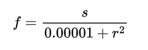

Conceptual Breakdown
====================

At its most basic form, the repulsor field calculates a set of forces applied by obstacles. 
Most obstacles use the same formula for calculating forces, with the exception of the guided obstacle.

The Obstacle Abstract Class
---------------------------
The `Obstacle` class is the base for all obstacles.
Here is the code for the `Obstacle` class:

.. code-block:: java

    public abstract static class Obstacle {
        double strength;
        boolean shouldRepel;

        /**
         * 
         * @param currentPosition Current robot position on the field
         * @param goalPosition Robot target position
         * @return Force acting on the robot from the current obstacle.
         */
        public abstract Force getForceAtPosition(Translation2d currentPosition, Translation2d goalPosition);

        /**
         * 
         * @param strength Strength repulsion force of the obstacle
         * @param shouldRepel Determines whether obstacle should repel or attract.
         */
        public Obstacle(double strength, boolean shouldRepel) {
            this.strength = strength;
            this.shouldRepel = shouldRepel;
        }

        /**
         * Calculates the force magnitude based on the distance from the obstacle.
         * 
         * @param distance Distance between the robot and the obstacle in meters.
         * @return Magnitude of the force acting on the robot from the obstacle.
         */
        protected double calculateForceMagnitude(double distance) {
            double forceMag = strength / (0.00001 + Math.abs(distance * distance));
            forceMag *= shouldRepel ? 1 : -1;
            return forceMag;
        }

        /**
         * Calculates the force magnitude with a falloff distance.
         * 
         * @param distance Distance between the robot and the obstacle in meters.
         * @param falloff Falloff distance in meters. Once past the falloff distance, the force will be 0.
         * @return Magnitude of the force acting on the robot from the obstacle.
         */
        protected double calculateForceMagnitude(double distance, double falloff) {
            var original = strength / (0.00001 + Math.abs(distance * distance));
            var falloffMag = strength / (0.00001 + Math.abs(falloff * falloff));
            return Math.max(original - falloffMag, 0) * (shouldRepel ? 1 : -1);
        }
    }

All obstacles use the `calculateForceMagnitude` method, so it is important to understand how it works. (It's based on the inverse square law.)

Point Obstacle
--------------

.. important::
    Make sure you are familiar with the FRC coordinate system. All calculations are field-relative.

A point obstacle extends the `Obstacle` class and represents a point in space that applies a force on the robot.
It inherits the `calculateForceMagnitude` method and implements the `getForceAtPosition` method.
Here is the implementation of the `getForceAtPosition` method:

.. code-block:: java

    public Force getForceAtPosition(Translation2d currentPosition, Translation2d targetPosition) {
        double distance = obstacleLocation.getDistance(currentPosition);
        if (distance > 4) { // if further than 4 meters, obstacle does not apply force
            return new Force();
        }

        // First calculates outward force
        double outwardForceMag = calculateForceMagnitude(obstacleLocation.getDistance(currentPosition) - obstacleRadius);
        Force initialForce = new Force(outwardForceMag, currentPosition.minus(obstacleLocation).getAngle());

        // Determines whether to go ccw or cw around the object
        Rotation2d theta = targetPosition.minus(currentPosition).getAngle().minus(currentPosition.minus(obstacleLocation).getAngle());
        double mag = (outwardForceMag * Math.signum(Math.sin(theta.getRadians() / 2))) / 2; // fancy trick to determine whether to go ccw or cw around the object.

        return initialForce
            .rotateBy(Rotation2d.kCCW_90deg) // rotates so the object does not go directly backward/forward into the reef
            .div(initialForce.getNorm())
            .times(mag)
            .plus(initialForce);
    }

If you are having trouble visualizing the force calcualtions, I recommend drawing out a scenario and going through the code line by line.

Vertical/Horizontal obstacles
----------------------------
Vertical and Horizontal obstacle only apply a direct repulsion force backward.
The robot will not be pushed towards the goal position by a force from a Horizontal/Vertical obstacle.
Here is the implementation of the `getForceAtPosition` method for a vertical obstacle:

.. code-block:: java

	public Force getForceAtPosition(Translation2d position, Translation2d target) {
		return new Force(0, calculateForceMagnitude(y - position.getY(), falloff));
	}
From the implementation, we can see that the force returned only considers horizontal/vertical distance from the wall.
The force is also always perpendicular to the obstacle.

Guided Obstacle
----------------
The guided obstacle iss essentially the same as a point obstacle, but it provides an additional force that guides the robot.
Here is the implementation of the `getForceAtPosition` method for a guided obstacle:

.. code-block:: java
    public Force getForceAtPosition(Translation2d currentPosition, Translation2d targetPosition) {

		//normal repulsion force calculation
        double initialMag = calculateForceMagnitude(obstacleLocation.getDistance(currentPosition));
		Force initialForce = new Force(initialMag, currentPosition.minus(obstacleLocation).getAngle());

		// Additionally "setpoint" force calculation to help guide hte object further.
		Translation2d targetToObstacle = obstacleLocation.minus(targetPosition);
		Rotation2d targetToObstacleAngle = targetToObstacle.getAngle();
        Translation2d sidewaysCircle = new Translation2d(obstacleRadius, targetToObstacle.getAngle()).plus(obstacleLocation);
        double sidewaysMag = calculateForceMagnitude(sidewaysCircle.getDistance(currentPosition)); 

		// Determines whether the robot should go ccw or cw around the obstacle
        Rotation2d sidewaysTheta = targetPosition
            .minus(currentPosition)
            .getAngle()
            .minus(currentPosition.minus(sidewaysCircle).getAngle());
        sidewaysMag *= Math.signum(Math.sin(sidewaysTheta.getRadians()));
		// Adds the inital force witht he additional guiding force together
        Rotation2d sidewaysAngle = targetToObstacleAngle.rotateBy(Rotation2d.kCCW_90deg);

        return new Force(sidewaysMag, sidewaysAngle).plus(initialForce);
    }

The guided obstacle works similar to a profiled PID controller, creating a "setpoint" in the direction of the goal.
It is recommended to use the guided obstacle for big obstacles like the reef in 2025.