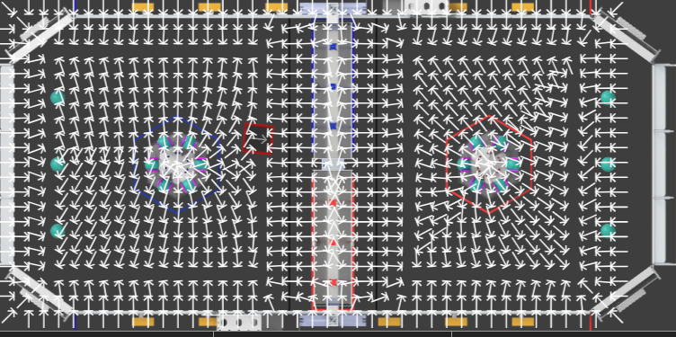

Repulsor Field
==============

Repulsor field is a way for the robot to navigate the field while avoiding obstacle.
In order for the robot to have consistent and accurate odometry.
When given a robot position, a goal position, and a list of obstacles,
we can calculate a vector field that essentially guides the robot to its target position while avoiding obstacles.

Repulsor field is best used with a simple drive to pose function.
You should transition between using repulsor field or the PID controller based on whether you have line of sight with the target position
or once you are within a certain distance of the target.

.. toctree::
   :maxdepth: 2

   conceptual
   RepulsorPathplanner
   CollisionDetection
   sampleCode